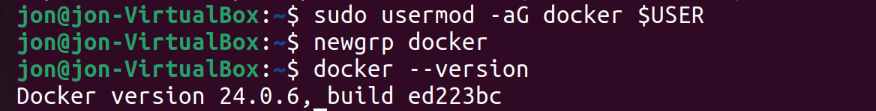
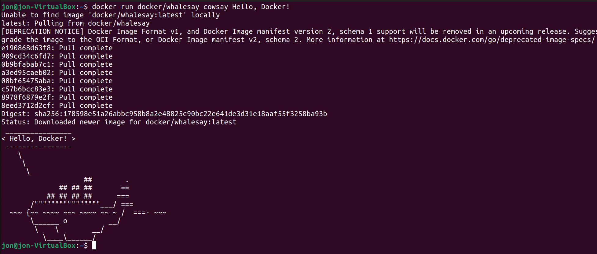
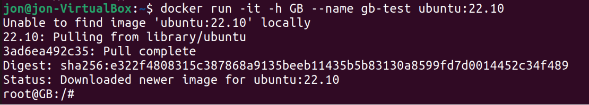
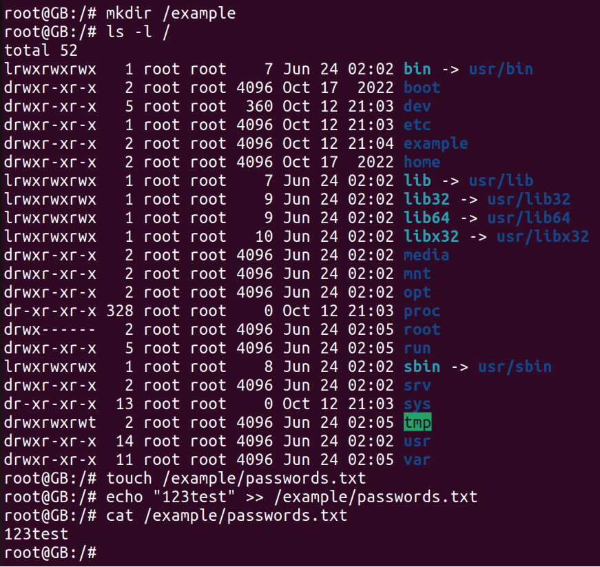
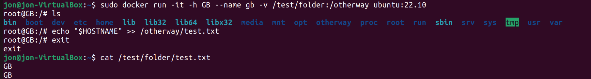

# Урок 3. Докер

## Установка Докер

`sudo apt update` - обновление списка пакетов

`sudo apt install apt-transport-https ca-certificates curl software-properties-common` - Установите пакеты, которые позволят использовать репозиторий по HTTPS

`curl -fsSL https://download.docker.com/linux/ubuntu/gpg | sudo gpg --dearmor -o /usr/share/keyrings/docker-archive-keyring.gpg` - официальный GPG-ключ Docke

`echo "deb [signed-by=/usr/share/keyrings/docker-archive-keyring.gpg] https://download.docker.com/linux/ubuntu $(lsb_release -cs) stable" | sudo tee /etc/apt/sources.list.d/docker.list > /dev/null` - репозиторий Docker к списку источников пакетов

`sudo apt update` - обновление списка пакетов

`sudo apt install docker-ce` - установка докер

`sudo usermod -aG docker $USER` - добавить пользователя в группу docker, чтобы избежать использования sudo для запуска Docker команд

Перезагрузить машину - `sudo reboot` 

`docker --version ` - проверить работу докер, вывести версию.

## Тестирование Докер

`docker run docker/whalesay cowsay Hello, Docker!` - Запуск контейнера с использованием образа "cowsay".

`docker run docker/whalesay cowsay -f elephant "Hello, Docker!"`

`docker run docker/whalesay cowsay -f tux "Hello, Docker!"`

`docker run docker/whalesay cowsay -f dragon "Hello, Docker!"`

`docker run docker/whalesay cowsay -f kangaroo "Hello, Docker!"`

`docker run docker/whalesay cowsay -f duck "Hello, Docker!"`

`docker run docker/whalesay cowsay -f panda "Hello, Docker!"`

`docker run docker/whalesay cowsay -f owl "Hello, Docker!"`

`docker run docker/whalesay cowsay -f kitty "Hello, Docker!"`

Эти команды запустят контейнеры с различными рисунками животных с использованием cowsay. Вы можете заменить текст "Hello, Docker!" на любой другой текст, который вы хотите, чтобы животное "сказало".

## Тестирование команд Докер

Создание и запуск контейнеров:

`docker run` - Запускает контейнер из образа.

`docker start` - Запускает остановленный контейнер.

`docker stop` - Останавливает работающий контейнер.

`docker restart` - Перезапускает контейнер.

`docker exec` - Выполняет команду внутри запущенного контейнера.

Управление контейнерами:

`docker rm $(docker ps -aq)` - удалит все остановленные контейнеры

`docker ps` - Просмотр списка запущенных контейнеров.

`docker ps -a` - Просмотр списка всех контейнеров (включая остановленные).

`docker rm` - Удаляет контейнер.

`docker logs` - Просмотр логов контейнера.

Работа с образами:

`docker images` - Просмотр списка образов.

`docker pull` - Загрузка образа с Docker Hub.

`docker build` - Сборка образа из Dockerfile.

`docker rmi` - Удаляет образ.

## Хранение данных в контейнерах Docker: Руководство с пояснениями

`docker run -it -h GB --name gb-test ubuntu:22.10` -  запустим контейнер из образа Ubuntu и войдем в него

`ls -l /` - просмотр содержимого корневой директории

`mkdir /example` - создаем папку в корне

`touch /example/passwords.txt` - создаем файл

`echo "123test" >> /example/passwords.txt` - запишем в файл строчку

Мы создали директорию и файл внутри контейнера Ubuntu. После остановки контейнера данные сохранятся, пока контейнер не будет пересоздан. Если удалить контейнер, то все данные, созданные в нем, будут утеряны.

 Использование внешнего хранилища. Создадим директорию и подмонтируем ее к контейнеру:

 `mkdir /test/folder`

`docker run -it -h GB --name gb-test -v /test/folder:/otherway ubuntu:22.10`

`echo "$HOSTNAME" >> /otherway/test.txt`

`cat /test/folder/test.txt`  - Проверим доступность данных с локальной системы

Если удалить контейнер и заново создать, подмонтирова дирректорию /test/folder/, то данные будут доступны в контейнере.

Самый надежный способ хранения данных в контейнерах - использование внешних хранилищ. Важно избегать хранения важных данных внутри контейнеров, чтобы предотвратить потерю информации.